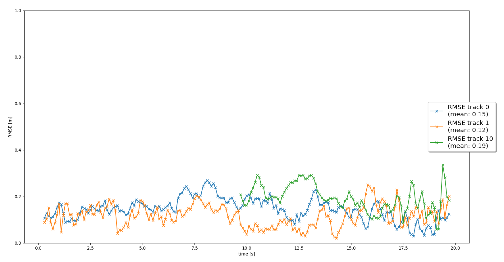

# Track 3D-Objects Over Time

## Project Overview

For this project, we perform multi-object trackings in real-world scenarios. Instead of only relying on the lidar sensor for object detections, the joint detections provided by lidar and color camera sensors are utilized for our 3D object trackings. This is an extension from [3D object detection project](./project_writeup_midterm.md).

## Short recap of the four tracking steps 

### 1. Filter ([filter.py](./student/filter.py))

The Kalman Filter class for predicting/updating a vehicle's state `x` and estimation covariance error `P` is implemented. When measurement data from lidar or color camera is received, `x`, `P` at timestamp `k` is updated, and then predicted at timestamp `k+1`. To track 3D objects, the 6x6 system matrix `F` consisting of 3D positions and velocities along with 6x6 process noise covariance matrix `Q` depending on the current timestamp dt are created. The single target tracking results and its corresponding RMSE plot (the residual between estimated state and ground truth state) are shown below. The mean RMSE is 0.32.

### 2. Track Management ([trackmanagement.py](./student/trackmanagement.py))

The track management to initialize and delete tracks, as well as to set a track state and a track score is implemented. At timestamp `k`, a new track is initialized if any measurement is left in the unassigned measurement list. The `x` and `P` are initialized based on the unassigned measurement transformed from Sensor coordinate to Vehicle coordinate. The track score for a new track is initialized with 0.1666 and the track state is set to `initialized`. A track's score will be accumulated if it is associated with measurements in next several frames, while a track's score will be decreased if it is unassigned and out of the sensor's field of view. A track's state is set to `tentative` if its track score is between 0.2 and 0.8. If the score is over 0.8, the state is set to `confirmed`. A `confirmed` track will be deleted if it drops below 0.6 or its estimation error covariance `P` is too large. Other than `confirmed` tracks, If a track's score is too low or `P` is too large, the tracks will also be deleted. The RMSE plot for one single track without track losses in between is shown below. The mean RMSE is 0.78.

### 3. Association ([association.py](./student/association.py))

A Single Nearest Neighbor Data Association method to associate measurements to tracks is implemented. The `Mahalanobis Distance` is applied to compute the distance between a track and a measurement. In addition, to reduces the association complexity when searching for the closest track/measurement pair during update, we use `Gating` method with chi-square-distribution to remove unlikely association pairs in advance. The Gating threshold is set to 0.995 in order to not remove too many correct measurements. At timestamp `k`, the unassigned track/measurement lists are initialized with stored tracks and measurements. If a track/measurement pair is found, they will be removed from the unassigned lists. The association process will continue until all possible track/measurement paris are found. The unassociated track/measurement left in the unassigned track/measurement lists are then updated. The following visualizations showed a multiple object tracking scenario with approximately 200 frames: three `confirmed` tracks are recorded with green bounding boxes around vehicles. No `confirmed` ghost tracks are found in a tracking sequence.

### 4. Camera Fusion ([measurements.py](./student/measurements.py))

The fusion of Lidar and Color camera sensors for predicting object motions is implemented. The measurement values for Lidar sensor is 3D positions `x, y, z`. The measurement noise covariance matrix `R` is 3x3. On the other hand, for the color camera sensor, only 2D positions `u, v` in image space can be measured. Hence, its covariance matrix `R` is 2x2. Unlike the Lidar sensor, the color camera sensor relies on a nonlinear measurement model h(x) to convert vehicle's state `x` to 2D measurement space. To get the residual covariance `S` and kalman gain `K`, the nonlinear function h(x) is linearized as Jacobian H. The `in_fov` function, which is used to determine whether a track should be updated at timestamp `k`, checks if the input state vector `x` of an object is within the field of view of the respective sensor type. The tracking updates all tracks when Lidar or Color camera measurements arrives to the system. The visualization of multiple object tracking results along with the RMSE plot can be seen below:

### Difficult parts in the project

The track/measurement association part was not trivial to complete. The closest track/measurement pair relies on the `Mahalanobis Distance` calculation with appropriate `Gating` threshold. However, to get globally optimal results, the Single Nearest Neighbor Association method may not be sufficient. Anther part that needs to be aware of is the removal of associated pair from unassigned track/measurement lists. The edge case such as min. entry in association matrix needs to be taken into account. Also, the update of the association matrix and the unassigned lists is crucial when a track/measurement pair is found.

## Benefits in camera-lidar fusion compared to lidar-only tracking  

By adding the second sensor color camera, the object detection can be strengthen thanks to the RGB information, which compensates the shortage part from lidar sensor. The high resolution image provided by the color camera sensor, as well as the capability of seeing objects really far way can help improve trackings.

## Challenges for sensor fusion system in real-life scenarios

Since each sensor type may have a different field of view, one concern is that how to deal with occlusion areas that some of sensors cannot capture while maintaining high accuracy for object detection. While fully covering the area of an ego car's surroundings may improve the detection, the calibration of heterogeneous sensors is still challenging.

## Possible improvements for current tracking results

Add more sensors to cover a wider area. Combine with different sensor types, for instance, radars to detect the object's position/velocity, stereo cameras for 2D/3D information.
