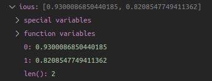

# 3D Object Detection

| Lidar 3D point clouds                 | 3D object detection in birds-eye view |
|:-------------------------------------:|:-------------------------------------:|
|  |  |

## Project overview

With the increase needs of the object detection accuracy for self-driving techniques, the detection system equipped with LiDAR sensors helps the self-driving car perceive the 3D world to have better understandings of its surroundings. For this project, a deep-learning approach is used to detect vehicles in LiDAR data ([Waymo Open dataset](https://waymo.com/open/)) based on a birds-eye view perspective of the 3D point-cloud. Detection performances such as Precision and Recall by comparing the ground truth labels with detection results are also evaluated. The steps of accomplishing 3D object detection are described below.

### Compute Lidar Point-Cloud from Range Image

#### 1. Visualize range image channels (`show_range_image` func. in [objdet_pcl.py](./student/objdet_pcl.py))

The first step is to get range images from Waymo dataset. The range and intensity channels in the range images are extracted and mapped onto the 8-bit scale. For the mapping, the negative values are filtered out. Also, to prevent very large value dominating in the 8-bit scale image, the intensity values are normalized with the difference between the 1- and 99-percentile of the data. Then, to focus on the scene at the front-view of vehicle, we crop range images to +/- 90 deg. left and right of the forward-facing x-axis. The visualization results of stacking the range and intensity images vertically are shown below:

#### 2. Visualize lidar point-cloud (`show_pcl` func. in [objdet_pcl.py](./student/objdet_pcl.py))

The range image can be converted into lidar point-cloud by spherical coordinates. The lidar point-cloud is fed into Open3D library's visualizer function for the visualization. 10 random images with varying degrees of visibility are taken:

| | |
|:---------------:|:---------------:|
| |  |
| |  |
| |  |
| |  |
| |  |

As seen in the images above, several perspective views for inspecting vehicle objects in a image sequence are captured. The white circle is the ego car's position. The stable feature on most vehicles are rear-bumpers, tail-lights and windows. In the intensity channel, these features also possess stronger intensity values.

### Create Birds-Eye View from Lidar PCL

The implementation can be found in `bev_from_pcl` func. in [objdet_pcl.py](./student/objdet_pcl.py).

#### 1. Convert sensor coordinates to BEV-map coordinates

In this task, the sensor coordinates in x,y [m] is converted into x,y [pixel] based on the 608 x 608 bev map. That is, the x, y values for each 3D point will be discretized into 608 x 608 cells. The visualization of 3D point cloud in the bev map coordinate is shown as follow:

#### 2. Compute intensity layer of the BEV map

After BEV coordinate transformation, we identify all points with the same (x,y)-coordinates within the BEV map and then assign the intensity value of the top-most lidar point to the respective BEV pixel. The function `np.lexsort` is used to sort the points within the same range (cell) in the BEV map. In each cell, only the top-most z-coordinate will be picked up. Then, the corresponding intensity values are normalized and mapped to 8-bit scale. The outliers such as large intensity values, will not be taken into account. As seen below for intensity map visualization, the position of ego-car is at upper left of the intensity map. Around the center of the intensity map, the vehicle's rear-bumper can be clearly spotted. 

#### 3. Compute height layer of the BEV map

Same as we did for intensity map computation, the top-most z value in each cell is picked up and normalized with the difference between the maximum and the minimum height. The visualization of height map is shown below. The pixel values of preceding vehicle's rear part depicted in the height map are higher comparing to the ground.

### Model-based Object Detection in BEV Image

The implementation can be found in `load_configs_model`, `create_model` and `detect_objects` func. in [objdet_detect.py](./student/objdet_detect.py).

#### 1. Add a second model from [Super Fast and Accurate 3D Object Detection based on 3D LiDAR Point Clouds](https://github.com/maudzung/SFA3D)

Aside from utilizing `Darknet` model for objection detection, here we add a second model `fpn_resnet` to detect vehicle objects in BEV image. The necessary configuration arguments for fpn_resnet are picked up and integrated into our codes. We then create the model by `get_pose_net` function. The input BEV map computed in the previous section is fed into the model for object inference. THe initial outputs we got are further decoded and post-processed. Finally, the bounding box information of detect objects in the BEV map can be acquired. For `fpn_resnet`, the parameters of each bounding box information in BEV map are structured as `[score, x, y, z, h, w, l, yaw]`, where `x, y` (pixel coordinate), `w, l` (width and height), `yaw` (orientation angle) can be used to draw the predicted 2D bounding box. In Debugging mode, the `v_object` variable can be inspected as shown in the image below:

#### 2. Extract 3D bounding boxes from model response

After we obtain the detected object's information associated with the BEV map, we convert them into metric coordinates in vehicle space. The converted result is denoted as `[c, x, y, z, h, w, l, yaw]`, where `c` represents the object class, `x, y, z` represents the object position, `h, w, l` represents the bounding box size, and `yaw` represents the bounding box's yaw angle. The ground-truth labels in 2D color image versus the detected bounding boxes in BEV map can be visualized:

### Performance Evaluation for Object Detection

#### 1. Compute intersection-over-union between labels and detections (`measure_detection_performance` func. in [objdet_pcl.py](./student/objdet_eval.py))

To evaluate the performance of Object Detection, we compute the geometrical bounding box overlap between ground-truth labels and detected objects. The min. IOU is set to 0.5. The object corners can be obtained based on `x, y, w, l, yaw`. We take the advantage of `Shapely` toolbox to generate polygons from the four corners of the current label/detected bounding boxes. Then the intersection over union (IOU) between label and detected bounding box can be computed. In case of multiple matches, only the object/label pair with max. IOU is kept, and the true positives count is accumulated if the IOU value of a object/label is greater than min. IOU threshold. The data structures `ious` and `center_devs` showed the following contents:

#### 2. Compute false-negatives and false-positives (`measure_detection_performance` func. in [objdet_pcl.py](./student/objdet_eval.py))

The total number of positives present in the scene is the number of valid labels within the defined area. The false-negatives, which is the number of undetected objects, is all-positive count minus true-positive count. The false-positives, which represents the number of incorrect object predictions, is detection count minus true-positive count.

#### 3. Compute precision and recall (`compute_performance_stats` func. in [objdet_pcl.py](./student/objdet_pcl.py))

We compute `precision` and `recall` by processing around 100 frames in a image sequence. The `precision` is 0.9438, and the `recall` is 0.8235. The performance measures are plotted below:

For ground truth comparisons, performance measurements on ground truth labeled objects is also conducted, which has the results of `precision` = 1 and `recall` = 1:

